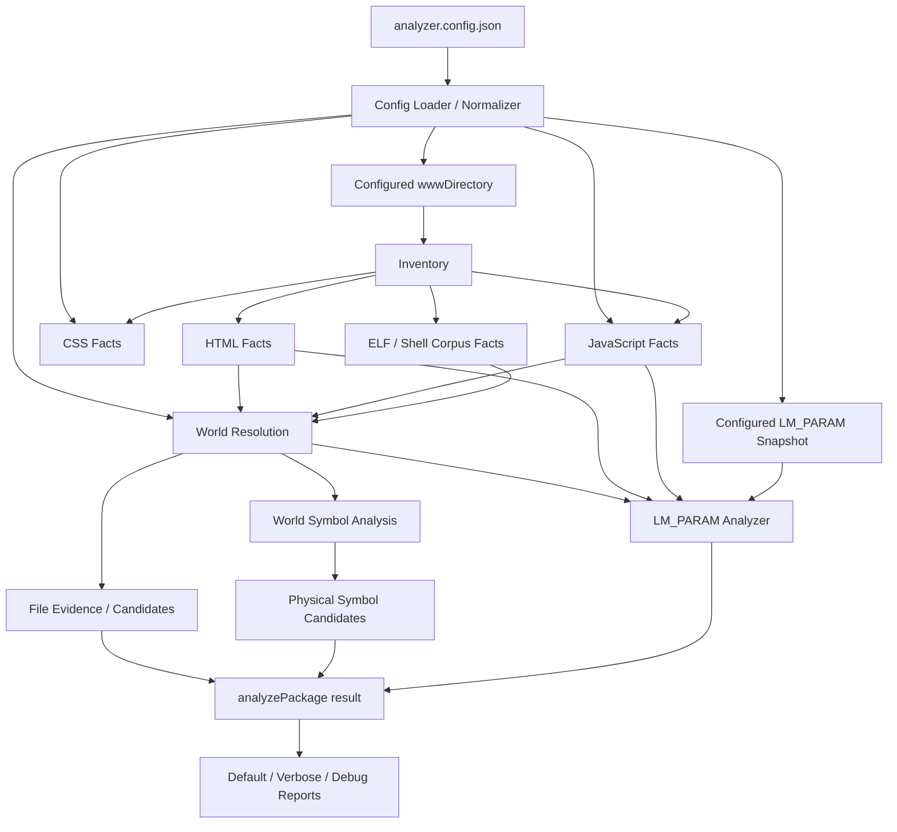

# RX Web Analyzer 架構說明

## 1. 系統目的

RX Web Analyzer 是一套針對 legacy RX WebUI 套件的唯讀靜態分析工具。它將檔案、瀏覽器執行環境、JavaScript symbol，以及後端提供的 `LM_PARAM` JSON 欄位整理成可供人工審查的 cleanup report。

本工具回答的是：

- 哪些實體檔案缺少已觀察到的引用證據？
- 哪些 JavaScript 實體宣告沒有已確認的 consumer？
- 哪些 `LM_PARAM` JSON 欄位沒有已確認的前端讀取？

本工具不會自動刪除檔案、symbol 或 JSON 欄位，也不會宣稱候選項目一定是 dead code。

## 2. 核心設計原則

### 2.1 Evidence first

Facts 層只收集證據，不直接做 cleanup 結論。World Resolution 將證據放回正確的瀏覽器環境，Analyzer 層才根據產品政策產生分類與 confidence。

### 2.2 Positive use 與 uncertainty 分離

已確認的 consumer 與動態不確定性是兩種不同狀態：

- 已確認的 consumer：從 cleanup candidate queue 移除。
- 不確定性：保留 candidate，透過 `HIGH`、`MEDIUM`、`LOW` 與 `riskFlags` 表達。

`LOW` 仍是可見的人工審查候選，不等於 suppression，也不代表可以自動刪除。

### 2.3 Runtime world membership 優先

只有實際參與 resolved browser world 的前端 source，才能成為主要 runtime consumer evidence。Inventory 中存在但未載入的 JavaScript，不會自動保護 symbol 或 `LM_PARAM` 欄位。

### 2.4 唯讀與可追溯性

Analyzer 不修改設定中指定的輸入目錄或 snapshot。每個重要結論都應保留 source、line、world、access mode 或 reference type，讓工程師能回到原始碼複查。

## 3. 整體資料流程



頂層協調器是 `src/analyzer.mjs`。`analyzePackage()` 依序建立：

1. `inventory`
2. `htmlFacts`
3. `jsFacts`
4. `cssFacts`
5. `corpusFacts`
6. `worldResolution`
7. `symbolAnalysis`
8. `symbolCandidates`
9. `lmParamAnalysis`
10. `fileReport`

上述結果會一起回傳，reporting 層不需要重新分析 source。

## 4. 設定與輸入

CLI 只讀取一次 `analyzer.config.json`，由 `src/config/analyzer_config.mjs` 驗證、正規化並將結果向下傳遞。目前設定指向清理後的 `4601D-RX` snapshot：

```json
{
  "input": {
    "wwwDirectory": "./4601D-RX/www",
    "lmParamsJson": "./4601D-RX/lm_params_json"
  },
  "browser": {
    "entryDocuments": [
      "index.html",
      "vw/index.html"
    ],
    "libraryGlobals": [
      {
        "library": "jQuery",
        "names": ["$", "jQuery"],
        "sourcePatterns": ["(^|/)jquery(?:[-.]\\d|\\.|$)"]
      }
    ]
  },
  "vendor": {
    "jsPatterns": ["(?:^|/)jquery(?:[-.]|$).*\\.min\\.js$"],
    "cssPatterns": []
  },
  "report": {
    "outputFile": "./reports/4601D-RX-report.html"
  }
}
```

### `input`

`wwwDirectory` 是必要欄位；`lmParamsJson` 可省略或設為 `null`。兩者的相對路徑都以設定檔所在目錄為基準解析，支援 `/` 與 Windows `\` 分隔符。CLI 將正規化後的絕對路徑傳給 analyzer modules，各模組不會自行讀取設定檔。

### `browser.entryDocuments`

指定無法只靠 incoming reference 自動判定的 top-level entry documents。其他 HTML 角色由跨檔案 evidence 推導。

Entry document 是 package 內部路徑；loader 會將 `\` 轉成 `/`，並拒絕絕對路徑或逃出 `wwwDirectory` 的 `..` 路徑。

### `browser.libraryGlobals`

描述需要「同一 world 中出現 provider source」才成立的 library globals。目前 jQuery 的 `$` 與 `jQuery` 延續原本行為。`sourcePatterns` 是不分大小寫的 regular expression source。

### `vendor`

`jsPatterns` 控制 vendor JavaScript 標記與既有 cleanup queue exclusion；預設 pattern 保留原本只辨識 minified jQuery 路徑的行為。`cssPatterns` 讓 CSS facts 能標示 package-specific vendor source，目前預設為空，因此不新增任何 CSS cleanup 判定。

### `report.outputFile`

指定 self-contained HTML report 的輸出位置。相對路徑同樣以 `analyzer.config.json` 所在目錄為基準，支援 Windows `\` 分隔符；parent directory 不存在時由 writer 建立。未設定時不會猜測 fallback 路徑，設定在 `input.wwwDirectory` 內則直接拒絕，避免修改 analyzed package。

### 預設值與錯誤

`browser.entryDocuments`、`browser.libraryGlobals`、`vendor.jsPatterns`、`vendor.cssPatterns` 與 `report.outputFile` 都有預設值。必要欄位缺失、型別錯誤、未知 key 或無效 regex 會直接產生包含設定位置的錯誤，不會被靜默忽略。

Captured `lm_params_json` 缺失、無法讀取或格式錯誤時，LM_PARAM analyzer 仍會產生 coverage/input error，不會讓整個 package analysis crash，也不會產生強 cleanup 結論。

## 5. Inventory 與 Facts 層

### 5.1 Inventory

`src/inventory/inventory.mjs` 遞迴列出 WebUI package，辨識 HTML、JavaScript、CSS、image、ELF、shell 等檔案類型。Inventory 只回答「套件內有哪些實體檔案」。

### 5.2 HTML Facts

`src/facts/html_facts.mjs` 使用 parse5 收集：

- external scripts
- inline scripts
- inline event handlers
- iframe
- link 與 AJAX fragment 線索
- form、stylesheet、asset references

此層不決定 HTML 是 entry、fragment 或 iframe document。

### 5.3 JavaScript Facts

`src/facts/js_facts.mjs` 使用 Acorn 收集：

- request、navigation、dynamic script load
- jQuery Tabs initialization
- URL expressions、top-level assignments 與簡單 URL helpers
- `eval`、string timeout、`new Function`、dynamic `window[x]` 等 dynamic sites
- statically parseable dynamic-code references

Generic JavaScript dynamism會保留為 evidence，但不得任意污染不相關的 symbol 或 LM_PARAM field。

### 5.4 CSS 與 Corpus Facts

- `src/facts/css_facts.mjs`：CSS import 與 `url(...)` resource evidence。
- `src/facts/corpus_facts.mjs`：ELF printable strings 與 shell text 的弱引用證據。

Corpus evidence 的可信度低於明確 AST/reference evidence，因此保留 evidence type 與分類來源。

## 6. World Resolution

`src/resolution/world_resolver.mjs` 將 raw facts 組合成瀏覽器執行環境。

### 6.1 World 規則

- Entry document 建立獨立 browser world。
- jQuery AJAX fragment 與 host document 共用 world。
- iframe 建立隔離的 child world。
- 同一 source 可被多個 worlds 載入。
- Script order、runtime base、literal bindings 與 dynamic imports 都保存於 world。

### 6.2 為什麼需要 World

單純掃描所有 `.js` 會產生錯誤 consumer：

- 未載入的檔案不應算 live usage。
- iframe 不應直接解析 parent world 的 symbol。
- AJAX fragment 中的 usage 應回到 host world。
- 同一實體 source 可能在一個 world 未使用、在另一個 world 被使用。

World Resolution 是 file、symbol 與 LM_PARAM analysis 共用的 runtime membership 基礎。

## 7. File Evidence 與 Cleanup Candidates

`src/report/file_report.mjs` 根據 world membership、HTML/JS/CSS references、corpus evidence 與 unresolved evidence，整理實體檔案的 incoming evidence。

File candidate 是人工審查線索，不是 deletion instruction。Dynamic pathname、asset naming、partial URL 與 unresolved references 必須保留，避免把不完整解析誤當成「未使用」。

## 8. Symbol Analysis

Symbol layer 位於 `src/symbols/`，與 LM_PARAM field policy 分離。

### 8.1 Source-level Symbol Facts

`symbol_facts.mjs` 使用 Acorn 與 eslint-scope 建立：

- lexical scopes
- definitions
- READ/WRITE references
- explicit `window.foo` bindings
- sloppy-mode implicit globals
- static `window.foo`／`window["foo"]` references
- initializer side-effect risk

Reference aggregation 以 eslint-scope 的 `Reference.resolved` binding identity 為準，會納入 descendant block scope 中解析到同一個 `Variable` 的 references，並排除 declarator initializer 自身的初始化 write。Direct `eval` 仍保留為 dynamic-risk evidence，但不會抹除 AST 中可靜態確認的 lexical reads。

### 8.2 World Symbol Resolution

`world_symbols.mjs` 與 `world_symbol_analyzer.mjs` 將 source facts 依 world 組合，解析：

- world globals
- local bindings
- unresolved globals
- multiple declarations
- parse/coverage errors

`global_classifier.mjs` 再區分 platform、library 與 unknown globals。

### 8.3 Physical declaration candidate model

Cleanup report 的單位是實體 source declaration，而不是每個 world 各產生一筆。

同一宣告載入多個 worlds 時：

1. 收集所有相關 world usage。
2. 任一 world 有 confirmed consumer，即不是 cleanup candidate。
3. 所有 worlds 都沒有 consumer，才評估 risk 與 confidence。

Candidate 會保留 `worldIds` 與 `worldEvidence`。跨 world 的 positive use 保留於內部 observations，並只在 debug report 列於 `USED / NOT-REMOVABLE OBSERVATIONS`；它不計入 candidate totals，也不屬於 analysis health metric。

常見 symbol risks 包含：

- `MULTIPLE_DECLARATIONS`
- `WRITE_ONLY_SYMBOL`
- `INITIALIZER_MAY_HAVE_SIDE_EFFECTS`
- `DYNAMIC_GLOBAL_PROPERTY_ACCESS`
- `DYNAMIC_SCRIPT_LOAD_PRESENT`
- `RUNTIME_DYNAMIC_CODE_IN_SOURCE`

## 9. LM_PARAM Field Analysis

LM_PARAM 分析完全位於 `src/lm_params/`，不把特定政策放入 generic symbol modules。

### 9.1 Facts

`lm_param_facts.mjs` 辨識：

- `LM_PARAM.FOO`
- `LM_PARAM["FOO"]`
- `window.LM_PARAM.FOO`
- `window["LM_PARAM"]["FOO"]`
- static object destructuring
- statically parseable string-based JavaScript

每個 access 保留：

- field
- sourceId / filePath
- line
- worldId
- access form
- `READ`、`WRITE` 或 `READ_WRITE`

eslint-scope 用來排除 function parameter 或 local variable 對 `LM_PARAM` 的 lexical shadowing。

### 9.2 READ 與 WRITE

LM_PARAM cleanup 問題是「前端是否消費後端提供的值」。因此：

- `READ`：confirmed consumer。
- `READ_WRITE`：confirmed consumer。
- `WRITE` only：不能證明後端欄位必要，仍是 candidate，加入 `WRITE_ONLY_FRONTEND_ACCESS`。

### 9.3 Package-wide field aggregation

`lm_param_analyzer.mjs` 只分析 resolved world sources，最後以 JSON field 為單位 package-wide 聚合。

主要分類：

- `FRONTEND_CONSUMED`
- `NO_FRONTEND_CONSUMER_CANDIDATE`
- `FRONTEND_FIELD_MISSING_FROM_JSON`

同一欄位在多個 source 或 world 的讀取會合併成一個 field record，並保留所有 consumer sites。

### 9.4 Dynamic evidence policy

LM_PARAM-specific evidence 才會降低 field confidence：

- `DYNAMIC_LM_PARAM_PROPERTY_ACCESS`
- `LM_PARAM_OBJECT_ESCAPE`
- `LM_PARAM_ENUMERATION`
- `LM_PARAM_SERIALIZATION`
- unsupported LM_PARAM destructuring
- LM_PARAM source coverage gap

例如 `LM_PARAM[field]` 不會猜測實際 field，也不會把全部欄位標為 consumed；零 static-read 欄位仍留在 candidate queue，但 confidence 會降低。

Generic `eval(responseText)` 若沒有 static LM_PARAM 關係，只保留在 analysis health 與 risk diagnostics，不會 package-wide 降低所有 LM_PARAM candidates。

### 9.5 Legacy existence guard

下列 pattern 只檢查／初始化 object，不代表 field escape：

```js
LM_PARAM || (LM_PARAM = {});
```

Analyzer 對此採窄化規則，不把它誤判為 `LM_PARAM_OBJECT_ESCAPE`。

## 10. Result Model

`analyzePackage()` 回傳的主要結構為：

```text
result
├── inventory
├── htmlFacts
├── jsFacts
├── cssFacts
├── corpusFacts
├── worldResolution
├── fileReport
├── symbolAnalysis
├── symbolCandidates
└── lmParamAnalysis
```

Facts 與 analysis results 同時存在，讓 reporting、tests 或後續工具可以檢查結論背後的原始證據。

## 11. Reporting

Reporting 位於 `src/report/`。`integrated_report.mjs` 只根據既有 analysis result 組合 mode-specific sections，內容中的 heading、confidence、warning、error、success、target、path 等樣式先表示成 semantic tokens：

```text
analysis result
      │
      ▼
integrated semantic report
      ├── terminal renderer → ANSI 或 plain text
      └── HTML renderer     → escaped HTML + embedded CSS
```

Renderer 不重新進行 candidate classification 或 confidence 判定。

### Default

提供 terminal-sized summary：

- package / world counts
- file、symbol、LM_PARAM candidate counts
- top candidates
- analysis health

### `--verbose`

列出完整人工審查 candidates、risk summaries、positive-use observations、LM_PARAM consumed/missing fields 與 coverage errors。

### `--debug`

額外輸出完整 `USED / NOT-REMOVABLE OBSERVATIONS`、world membership、references、corpus findings、raw symbol diagnostics 與 LM_PARAM access sites。

色彩只用於 headings、confidence/status 與 review-target 名稱。Target 名稱使用綠色；redirected output、非 TTY 或設定 `NO_COLOR` 時不輸出 ANSI sequences。

HTML export 依執行 mode 產生相同主要 sections，使用 monospace、保留 whitespace，並將所有 report-derived content HTML escape。CSS 完整內嵌，不包含 external stylesheet、script、CDN 或 asset；HTML semantic colors 不受 TTY、redirected stdout 或 `NO_COLOR` 影響。

## 12. Error 與 Coverage Policy

Analyzer 應局部失敗、整體繼續：

- JavaScript parse error：保留 source/world coverage gap。
- LM_PARAM JSON error：LM_PARAM analysis unavailable，但其他分析繼續。
- Dynamic property 無法解析：保留 risk，不猜測欄位。
- Partial/unresolved URL：保留 evidence，不提升為確定引用或確定未使用。

Coverage 不完整時不得產生強 confidence 結論。

## 13. 測試策略

Tests 使用作業系統 temporary directories 建立最小 synthetic packages，不複製或修改設定中的實際輸入 package。

測試分為：

- facts 與 URL resolution
- world membership、AJAX fragment、iframe isolation
- symbol binding 與 physical declaration candidates
- LM_PARAM access modes、shadowing、dynamic risks、world aggregation
- default／verbose／debug reporting 與 `NO_COLOR`
- self-contained HTML、escaping、semantic color 與 terminal/HTML section parity

每次新增 evidence 或 policy 時，應同時測試：

1. 正向 consumer。
2. 零 consumer candidate。
3. dynamic uncertainty 仍可見。
4. 不相關 source/world 不得污染結果。
5. malformed/unavailable input 的 coverage behavior。

## 14. 非目標

目前架構刻意不做：

- 自動刪除或修改 analyzed files
- 自動修改 `lm_params_json`
- transitive function reachability / dead-code elimination
- 任意 computed property 推論
- 任意 runtime eval interpretation
- 將所有 inventory JavaScript 視為 live
- 用單一 dynamic site blanket suppress 全部 candidates

若未來新增分析能力，應延續「Facts → World Resolution → Domain Analyzer → Report」的分層，避免把產品政策塞回通用 AST facts。
